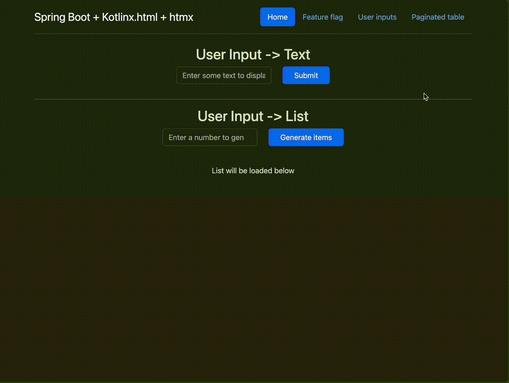
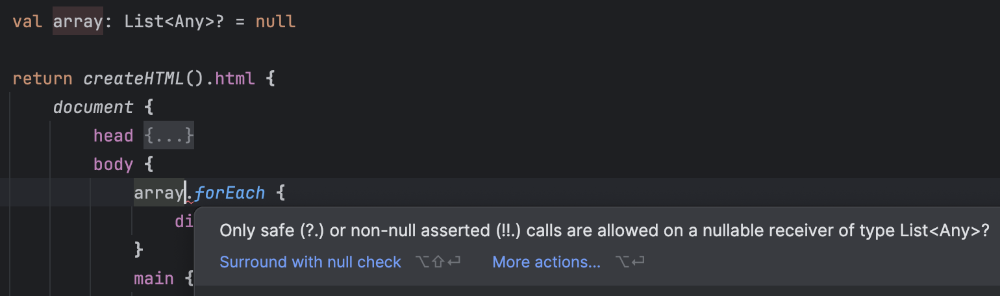
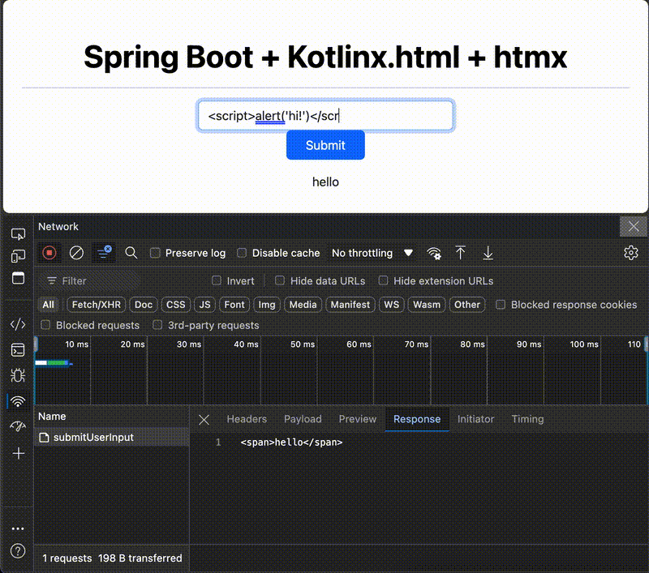
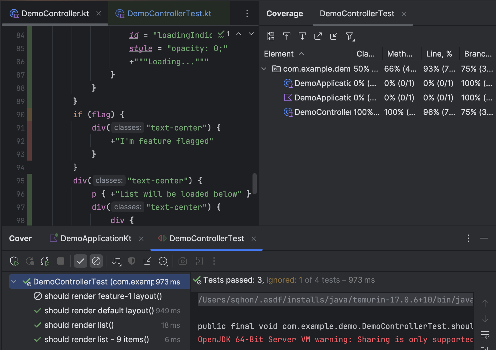

# Spring Boot + kotlinx.html + htmx

Inspired by [Radical Simplicity](https://www.radicalsimpli.city/)
and [DjangoCon 2022 | From React to htmx on a real-world SaaS product: we did it, and it's awesome!](https://www.youtube.com/watch?v=3GObi93tjZI)



## Goal

> To reduce the complexity of a full stack feature delivery by replacing Node.js tooling with Kotlin equivalents

As the Node.js ecosystem and tooling evolve, the number of dependencies to keep up to date with is quite significant:

- Node.js; v14 (April 2020) -> v24 (Jul 2024)
- React
- React Hooks
- styled-components
- axios/fetch/GraphQL
- MobX / Redux
- Webpack / Parcel / esbuild
- Babel
- Javascript
- Typescript
- ESLint
- Storybook
- CSS / SASS / PostCSS / Autoprefixer

The overhead is compounded due to each library having different release cycles.

## Chosen technologies

### Kotlinx.html

This replaces Typescript and JSX completely:

- Providing compile-time type safety
- Removing the need to maintain API contracts between frontend and backend
- Removing the need to serialize DTOs
- Enables more UI unit testing via JUnit, rather than end-to-end tests (Cypress/Playwright/Selenium/TestCafe) that
  increase the lead time to deploy

Taking inspiration from React concepts:

- Conditional code simply uses Kotlin
- Extracting components is as easy as creating a Kotlin function

Debugging can also be done within the JVM, eg logging during the generation of the html response.

For example:

```kotlin
fun renderPage() {

    return createHTML()
        .html {
            document {
                body {
                    if (flag) {
                        log.debug("Rendering feature flagged code...")
                        div("text-center") {
                            +"I'm feature flagged"
                        }
                    }
                    pageHeader(title = "This is a React functional component equivalent")
                }
            }
        }
}

fun FlowContent.pageHeader(title: String) {
    header {
        +title
    }
}

```

### htmx

Now that templating is handled, we need to solve for data retrieval and state management.

htmx provides a HTML attribute based approach, removing the need for:

- axios/fetch
- UI state management (React Hooks / MobX / Redux)

```kotlin
button(classes = "btn btn-primary btn-md px-4 gap-3") {
    attributes["hx-get"] = "/data-list"
    attributes["hx-target"] = "#data-list"
    attributes["data-testid"] = "primary-button"
    type = ButtonType.submit
    +"Click me"
}

div {
    id = "data-list"
}
```

Combined with kotlinx.html, JUnit tests can be written to assert the various htmx attributes.

```kotlin
@Test
fun `should render feature-1 layout`() {
    System.setProperty("feature-1", "true")
    val html = controller.renderDashboard()

    val doc: Document = Jsoup.parse(html)
    val primaryButton = doc.select("[data-testid='primary-button']")

    assertEquals("Click me", primaryButton.text())
    assertEquals("/data-list", primaryButton.attr("hx-get"))
    assertEquals("#data-list", primaryButton.attr("hx-target"))

    assertContains(doc.text(), "I'm feature flagged")
}
```

## Examples

### Testing with Kotlinx.html

```kotlin

@PostMapping("/list")
fun renderList(@RequestParam number: Int): String {
    return createHTML()
        .ul {
            repeat(number) {
                li {
                    +"Item ${it + 1}"
                }
            }
        }
}

// ...

@Test
fun `should render list`() {
    val number = 5
    val html = controller.renderList(number)

    val doc: Document = Jsoup.parse(html)

    val listItems = doc.getElementsByTag("li")

    listItems.forEach {
        it.text() shouldContain "Item "
    }

}

```

### Creating nested components

#### React
```typescript
const Wrapper = ({children}: {children: JSX.Element}) => {
  return <header>{children}</header>
}

const Page = () => {
    return <div>
        <Wrapper>
            <p>Hello</p>
        </Wrapper>
    </div>
}
```

#### Kotlin.html
```kotlin
fun FlowContent.wrapper(children: () -> Unit) {
    header {
        children()
    }
}


fun FlowContent.page() {
    div {
        wrapper {
            p {
                +"Hello"
            }
        }
    }
}

```

### Creating conditional UIs

#### React
```typescript
interface Props { 
    show: boolean;
}

const Demo = ({show = false}: Props) => {
    return <div>
        {show && <p>Hello</p>}
    </div>
}


const Page = () => {
    return <div>
        <Demo/>
        <Demo show={true}/>
    </div>
}
```

#### Kotlin.html
```kotlin
fun FlowContent.demo(show: Boolean = false) {
    div {
        if (show) {
            p {
                +"Hello"
            }
        }
    }
}

fun renderPage(): String {
    return createHTML()
        .div {
            demo()
            demo(show = true)
        }
}

```

### Type safety




### Handling Cross Site Scripting



### Test coverage



## Comparisons

Ultimately, each Node.js ecosystem tool aims to improve the predictability of how we develop, test and package
interactive user interfaces.

### Workflow comparison

Assuming a new vertical slice, this would be a typical high level workflow

| Using Spring + Thymeleaf + React                                          | Using Kotlinx.html and htmx                                       |
|---------------------------------------------------------------------------|-------------------------------------------------------------------|
| 1. Create Spring JPA Repo                                                 | 1. Create Spring JPA Repo                                         |
| 2. Create Spring Service                                                  | 2. Create Spring Service                                          |
| 3. Create Spring Controller                                               | 3. Create Spring Controller                                       |
| 4. Create Kotlin data classes                                             | 4. Create Kotlin data classes                                     |
| 5. Create JUnit tests                                                     | 5. Create Kotlinx.html template with htmx tags                    |
| 6. Create new Webpack entry                                               | 6. Create JUnit tests                                             |
| 7. Create new API retrieval layer                                         | 7. Spring Controller method returns HTML via kotlinx.html         |
| 8. Create Typescript data classes to match API response                   | 8. Load base styles into DOM                                      |
| 9. Create UI state (MobX observers or Redux actions/dispatchers/reducers) | 9. htmx manages the data and re-renders the relevant DOM elements |
| 10. Create React component                                                |                                                                   |
| 11. Create Jest tests                                                     |                                                                   |
| 12. Bundle TS and JS vendor files into minified vendor assets             |                                                                   |
| 13. Bundle TS and JS project files into minified project assets           |                                                                   |
| 14. Host JS and CSS either on a CDN or in a static folder                 |                                                                   |
| 15. Spring Thymeleaf generates HTML                                       |                                                                   |
| 16. Load React into DOM                                                   |                                                                   |
| 17. Load project bundle into DOM                                          |                                                                   |
| 18. Initialise React application                                          |                                                                   |
| 19. Fetch data from API                                                   |                                                                   |
| 20. Parse JSON into Javascript objects                                    |                                                                   |
| 21. React creates a virtual DOM and observes for stateful changes         |                                                                   |
| 22. React re-renders the relevant DOM elements                            |                                                                   |

### Feature comparison

| Feature               | With Node.js                                                                                 | Without Node.js                             |
|-----------------------|----------------------------------------------------------------------------------------------|---------------------------------------------|
| Dependency Management | Maven + NPM/Yarn                                                                             | Maven + [webjars](https://www.webjars.org/) |
| Module management     | Maven + Yarn workspaces/Nx/Lerna + Webpack entries + Webpack Module Federation               | Maven                                       |
| Date formatting       | Java date + moment.js + date-fns                                                             | Java date                                   |
| Currency formatting   | Java currency + browser locale                                                               | Java currency                               |
| Syntaxes              | Kotlin + Thymeleaf + React + Styled Components                                               | Kotlin + htmx                               |
| Safety checks         | Kotlin + Typescript + ESLint                                                                 | Kotlin                                      |
| Logging/Debugging     | Kotlin + Browser console + Sentry                                                            | Kotlin                                      |
| Data retrieval        | Kotlin data class + Typescript interface + axios/fetch                                       | Kotlin data class                           |
| Conditional UIs       | Kotlin + Typescript + React JSX                                                              | Kotlin                                      |
| CI                    | JUnit + Spring Testing + Webpack + Babel + Minifying + Typescript + ESLint + Jest            | JUnit + Spring Testing + JSoup              |
| Artifacts             | jar/war + Webpack vendor bundles + Webpack hashed entrypoint + Webpack hashed JS/CSS bundles | jar/war                                     |
| UI Datepicker         | react-datepicker / AntD / react-bootstrap + native HTML date input                           | (wip)                                       |
| UI Daterangepicker    | react-daterangepicker / AntD / react-bootstrap + native HTML date input                      | (wip)                                       |
| UI Datatables         | react-data-table-component / AntD / react-bootstrap                                          | (wip)                                       |
| UI Combobox           | react-select / AntD / react-bootstrap                                                        | (wip)                                       |
| UI Modal              | react-modal / AntD / react-bootstrap                                                         | (wip)                                       |


## Useful resources

### Feature demos
- [(2:26) htmx in 100 seconds](https://www.youtube.com/watch?v=r-GSGH2RxJs)
- [(8:32) htmx for Impatient Devs](https://www.youtube.com/watch?v=TT7SV-bAZyA)
- [(11:55) Top 5 htmx features](https://www.youtube.com/watch?v=cmOz0GU5ol8)
- [(57:25) htmx: Why You Don't Always Need a SPA Framework - Duncan Hunter - NDC Sydney 2024](https://www.youtube.com/watch?v=KbIrMpccdbI)
- [(22:35) htmx is pro-Javascript](https://www.youtube.com/watch?v=9ZhmnfKD5PE)
- [(26:46) A Real World React -> htmx Port](https://htmx.org/essays/a-real-world-react-to-htmx-port/)

### Reading material
- [htmx.org essays by Carson Gross (creator of HTMX)](https://htmx.org/essays/)
  - [When to use Hypermedia](https://htmx.org/essays/when-to-use-hypermedia/)
  - [A Response To "Have Single-Page Apps Ruined the Web?"](https://htmx.org/essays/a-response-to-rich-harris/)
  - [Why htmx Does Not Have a Build Step](https://htmx.org/essays/no-build-step/)

